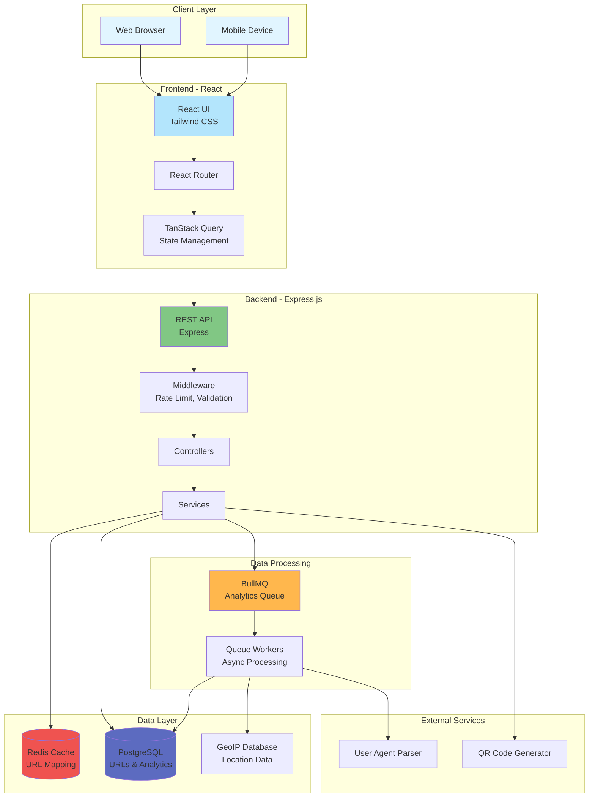
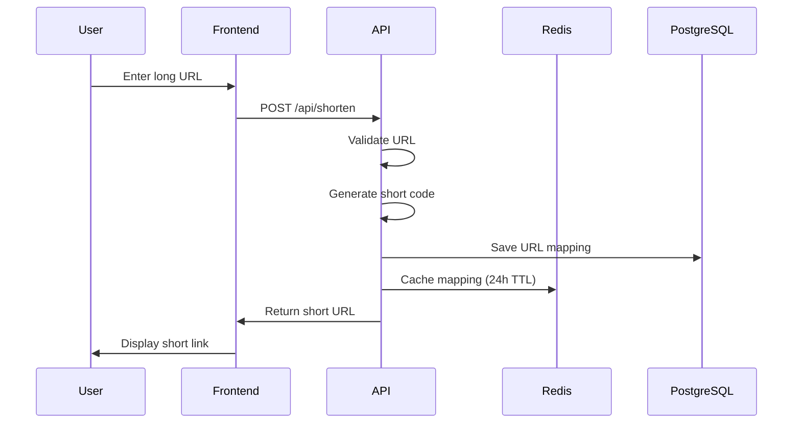
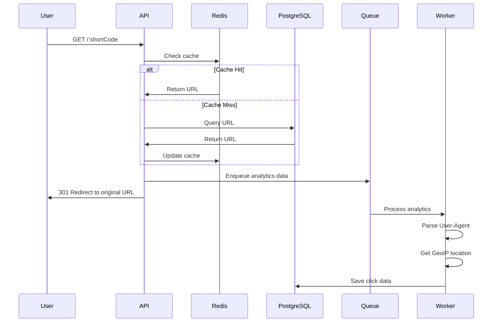
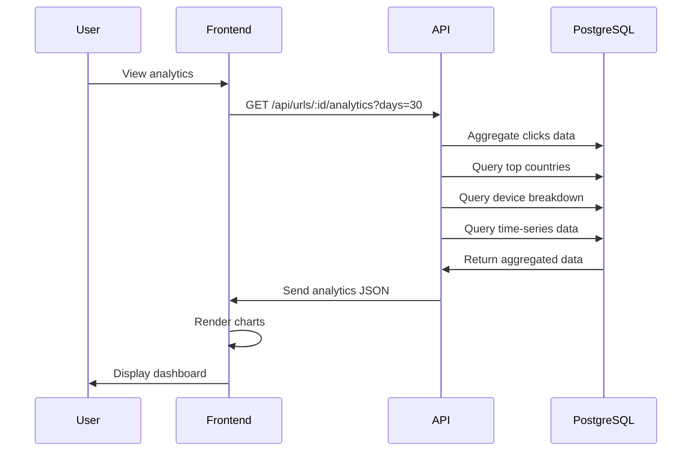
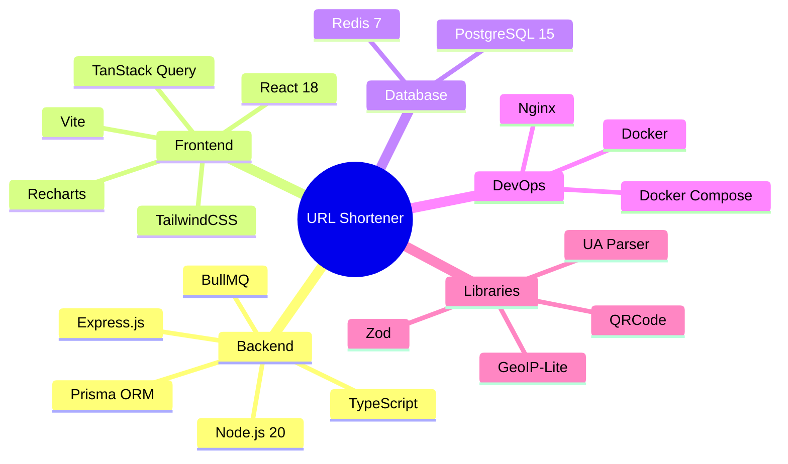
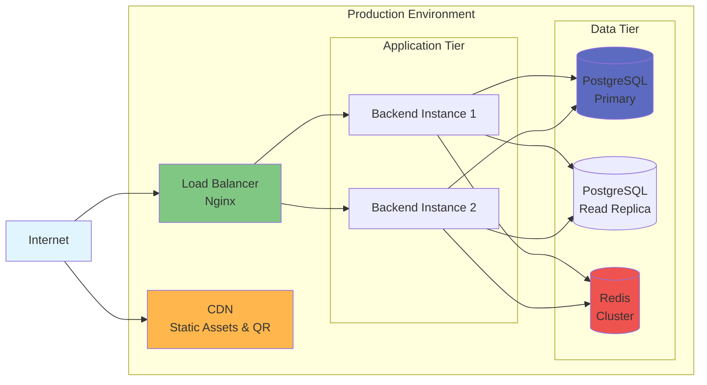
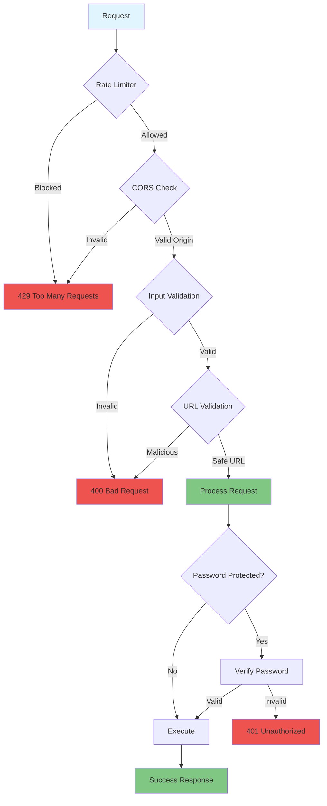

# URL Shortener Architecture

## Data Flow

### 1. URL Shortening Flow

### 2. Redirect & Analytics Flow

### 3. Analytics Query Flow

## System Components

### Frontend Components
- **UrlShortenerForm**: Main URL input form with validation
- **UrlList**: Paginated list of user's links
- **AnalyticsDashboard**: Comprehensive analytics with charts
- **UI Components**: Reusable Button, Input, Card components

### Backend Services
- **UrlService**: URL CRUD operations, caching
- **AnalyticsService**: Data aggregation, export
- **QRCodeService**: QR code generation in PNG/SVG

### Queue System
- **Analytics Queue**: Asynchronous click processing
- **Workers**: Background job processors (10 concurrent)

### Middleware
- **Rate Limiter**: IP-based throttling (10/hour)
- **Validation**: Zod schema validation
- **CORS**: Cross-origin security
- **Helmet**: Security headers

## Technology Stack

## Deployment Architecture

## Security Layers

